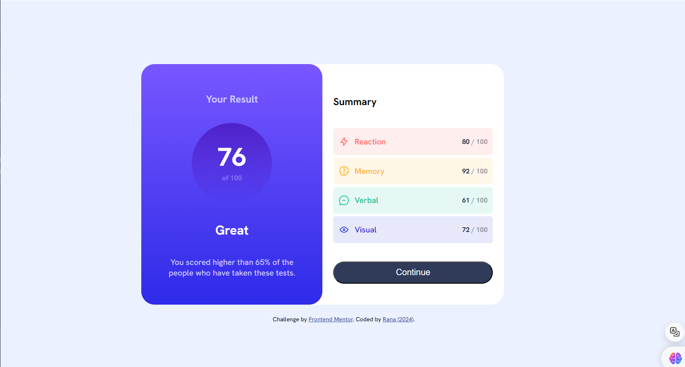

# Frontend Mentor - Results summary component solution

This is a solution to the [Results summary component challenge on Frontend Mentor](https://www.frontendmentor.io/challenges/results-summary-component-CE_K6s0maV). Frontend Mentor challenges help you improve your coding skills by building realistic projects.

## Table of contents

- [Overview](#overview)
  - [The challenge](#the-challenge)
  - [Screenshot](#screenshot)
  - [Links](#links)
- [My process](#my-process)
  - [Built with](#built-with)
  - [What I learned](#what-i-learned)
  - [Continued development](#continued-development)
- [Author](#author)

## Overview

### The challenge

Users should be able to:

- View the optimal layout for the interface depending on their device's screen size
- See hover and focus states for all interactive elements on the page
- **Bonus**: Use the local JSON data to dynamically populate the content

### Screenshot



### Links

- Solution URL: [Add solution URL here](https://your-solution-url.com)
- Live Site URL: [Add live site URL here](https://your-live-site-url.com)

## My process

### Built with

- Semantic HTML5 markup
- CSS custom properties
- Flexbox
- [React](https://reactjs.org/) - JS library
- [Next.js](https://nextjs.org/) - React framework

### What I learned

I have learnt the use of props in React!!
also I have learnt to user the map function to populate mutliple components

```js
summaryList.map((x) => (
  <Tile
    key={x.id}
    icon={x.icon}
    name={x.name}
    score={x.score}
    color={x.color}
    tileColor={x.tileColor}
  />
));
```

### Continued development

I would love to create the app for the mobile size screen but i did not for this challenge.

## Author

- Website - [RanaHafezPortfolio](https://portofolio-8jzk.onrender.com/)
- Frontend Mentor - [@RanaHafez](https://www.frontendmentor.io/profile/RanaHafez)
- Linkedin - [@RanaHafez](https://www.linkedin.com/in/rana-hafez-a34315227/)

# Rana Hafez (2024)
